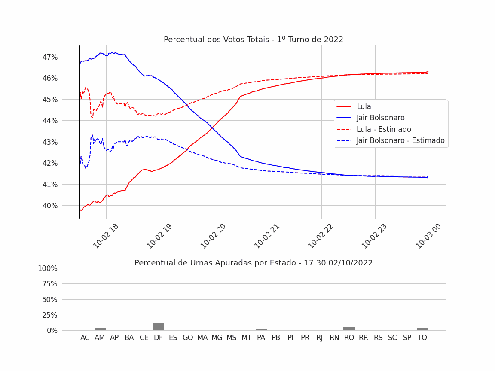
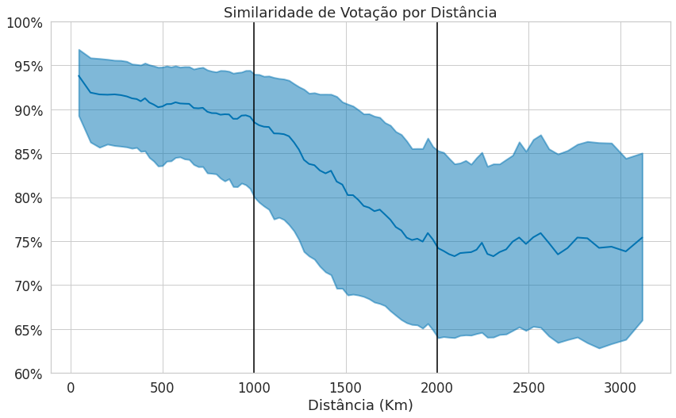

# Eleições 2022: a apuração do 1º turno em dados

Análise dos dados abertos do Tribunal Superior Eleitoral (TSE) sobre o 1º turno da eleição presidencial de 2 de outubro de 2022, feita em outubro de 2022. Ela parte de três perguntas:

1. Como a contagem evoluiu ao longo da noite, e por que a ordem dos candidatos na contagem parcial mudou durante a apuração?
2. Como o voto se distribui pelo território?
3. Até que distância duas regiões votam de forma parecida?

O objetivo é técnico: mostrar o que os dados públicos permitem medir e como tratá-los. Não há aqui opinião sobre candidatos, partidos ou o sistema eleitoral.

> **English summary.** An analysis of the public data of Brazil's Superior Electoral Court (TSE) for the first round of the 2022 presidential election. (1) The count over election night is rebuilt from the time each ballot-box report was received. Projecting each state's partial result onto its full electorate shows that the lead change in the raw count came from the order in which the states reported. (2) The vote is mapped by electoral zone, using the TSE's official polling-place coordinates, and interpolated with a small neural network. (3) The similarity of the vote between two places is measured as a function of distance. Notebooks are in Portuguese.

A apuração minuto a minuto, das 17h30 à meia-noite de 2/10/2022. Em cima, a contagem parcial (linhas contínuas) e a estimativa por estado (tracejadas). Embaixo, a porcentagem de urnas apuradas em cada estado.

## Resultados

1. **A contagem parcial depende da ordem em que os estados apuram.**
   - O horário de recebimento de cada boletim de urna permite reconstruir a contagem minuto a minuto.
   - Cada estado apurou num ritmo diferente. Às 18h36, o Distrito Federal tinha cerca de 75% das urnas apuradas, e São Paulo, Rio de Janeiro, Bahia e Minas Gerais estavam abaixo de 10%.
   - Na **estimativa**, o resultado parcial de cada estado é ponderado pelo número de eleitores aptos dele. Ela pôs o mesmo candidato à frente durante toda a noite, enquanto a contagem bruta só mudou de ordem perto das 20h.
   - No fim da apuração, as duas curvas chegam ao resultado final: 46,3% e 41,3% do total de votos, a escala do gráfico, ou 48,43% e 43,20% dos votos válidos.
2. **O voto tem padrão regional.**
   - Os mapas mostram a proporção de votos dos dois mais votados em cada zona eleitoral, para o Brasil, Minas Gerais e a cidade de São Paulo.
   - Uma rede neural pequena, que recebe a latitude e a longitude, interpola esses valores e gera um mapa contínuo.
   - Os mapas foram refeitos em 2026 com as coordenadas oficiais do TSE (veja [Sobre as coordenadas](#sobre-as-coordenadas)).
3. **Lugares próximos votam de forma parecida, e a semelhança cai com a distância.**
   - A semelhança entre dois lugares é medida entre as distribuições de votos de cada par de zonas: 1 menos a distância euclidiana entre os vetores de percentuais, normalizada.
   - A mediana passa de 94% entre lugares vizinhos para 88% a 1.000 km e 74% a 2.000 km. Daí em diante, fica estável.
   - O notebook também mapeia dois índices locais, num raio de 500 km: a **semelhança local**, o quanto o voto de um lugar se parece com o dos vizinhos, e a **variação local**, o quanto o voto muda nesse raio. Por fim, marca os **pontos representativos**: os de maior semelhança local, a pelo menos 500 km uns dos outros.

## Notebooks

| Notebook | Nome original | O que faz |
|---|---|---|
| [`01_coordenadas_das_zonas`](notebooks/01_coordenadas_das_zonas.ipynb) | Novo (2026); substitui o `00_Geolocalizacao` | Dá a cada zona eleitoral um ponto no mapa, a partir das coordenadas dos locais de votação publicadas pelo TSE |
| [`02_evolucao_da_apuracao`](notebooks/02_evolucao_da_apuracao.ipynb) | `01_Analises_Temporais` | Resultado do 1º turno, contagem minuto a minuto pelo horário dos boletins de urna, estimativa ponderada por estado e a animação |
| [`03_mapas_e_interpolacao`](notebooks/03_mapas_e_interpolacao.ipynb) | `02_Analises_Geolocalizacao` | Mapas do voto por zona (Brasil, Minas Gerais e São Paulo) e interpolação com uma rede neural (TensorFlow). Rodado de novo em 2026 |
| [`04_semelhanca_do_voto_e_distancia`](notebooks/04_semelhanca_do_voto_e_distancia.ipynb) | `04_Analises_Propagacao` | Semelhança entre as distribuições de votos em função da distância e os dois índices locais. Rodado de novo em 2026 |
| [`05_estimativa_por_estado`](notebooks/05_estimativa_por_estado.ipynb) | `03_Simulador_2Turno` | Uma grade para digitar percentuais por estado e calcular o total nacional ponderado pelos eleitores aptos. As saídas foram limpas |

## Dados

Os dados de votação e as malhas não estão no repositório. Baixe-os das fontes:

| Pasta | Arquivos | Fonte |
|---|---|---|
| `dados_votacao/` | `votacao_secao_2022_BR.zip`, `detalhe_votacao_secao_2022.zip` | TSE, [resultados 2022](https://dadosabertos.tse.jus.br/dataset/resultados-2022) |
| `dados_boletim_urna/` | `bweb_1t_<UF>_051020221321.zip`, um por estado mais o exterior (`ZZ`) | TSE, [boletins de urna 2022](https://dadosabertos.tse.jus.br/dataset/resultados-2022-boletim-de-urna) |
| `dados_malhas_ibge/` | `BR_Pais_2021.zip`, `BR_UF_2021.zip`, `BR_Municipios_2021.zip`, `BR_Setores_2020.zip` | IBGE, [malhas territoriais](https://geoftp.ibge.gov.br/organizacao_do_territorio/malhas_territoriais/) |
| `dados_locais_votacao/` | `eleitorado_local_votacao_2022.zip`, com a latitude e a longitude do local de votação de cada seção | TSE, [eleitorado 2022](https://dadosabertos.tse.jus.br/dataset/eleitorado-2022). O notebook 01 baixa o arquivo se ele faltar |
| [`dados_zonas_eleitorais/`](dados_zonas_eleitorais/) | Lista das zonas eleitorais de cada estado, com o endereço do cartório | Exportada do site do TSE em outubro de 2022 (no repositório) |
| [`dados_coordenadas_zonas/`](dados_coordenadas_zonas/) | Um ponto (latitude e longitude) para cada zona eleitoral | Gerada pelo notebook 01 (no repositório) |

### Sobre as coordenadas

- **De onde vêm.** Cada zona eleitoral é um ponto: a mediana das coordenadas dos locais de votação das suas seções, ponderada pelo número de eleitores. As coordenadas são as do arquivo *Eleitorado por local de votação - 2022*, do TSE. O notebook 01 explica o que acontece com as zonas sem coordenada e com os locais que o arquivo põe em outro estado.
- **O que mudou em 2026.** Em 2022, as coordenadas vinham de buscas do endereço de cada cartório no Google Maps, feitas com o Selenium. Elas foram trocadas pelas do TSE por dois motivos:
  - os termos de uso do Google proíbem esse tipo de coleta;
  - a comparação com o TSE mostrou erros. Em 167 zonas (6%), o ponto de 2022 estava a mais de 1.000 km do ponto do TSE, e 56 delas tinham caído fora do Brasil.
- **Consequência.** Os mapas e os gráficos dos notebooks 03 e 04 foram refeitos em 2026 e não são iguais aos de 2022.

## Para rodar

1. Crie as pastas `dados_*` acima na raiz do repositório e baixe os arquivos.
2. Os notebooks 01, 03 e 04 rodam como estão, a partir da pasta `notebooks/` (a variável `PASTA_DO_PROJETO` aponta para a raiz). Nos notebooks 02 e 05, troque `<PASTA_DO_PROJETO>` pela raiz do repositório: eles rodaram no Google Colab, com o Google Drive montado.
3. **Atenção ao turno.** Em 2022, os arquivos de votação tinham só o 1º turno. Hoje eles trazem os dois. Os notebooks 03 e 04 já filtram `NR_TURNO == 1`. Nos notebooks 02 e 05, acrescente o filtro em `trata_detalhe` e `trata_votacao`, junto com o filtro de cargo. Os boletins de urna (`bweb_1t_...`) já são só do 1º turno.
4. Pacotes: pandas, numpy, matplotlib, seaborn, geopandas e tensorflow. Em 2026, os notebooks 01, 03 e 04 rodaram com Python 3.11, pandas 2.2, geopandas 1.0 e TensorFlow 2.15, em CPU. O 03 usa a API do Keras 2, que vem até o TensorFlow 2.15.

## Sobre esta versão

Este repositório foi montado em 2026 a partir do meu Google Drive.

- **Notebooks 02 e 05.**
  - Saíram os metadados do Colab, o estado dos widgets, os botões e scripts das tabelas do Colab e os caminhos do Drive (`<PASTA_DO_PROJETO>`).
  - Os logs de instalação foram encurtados.
  - Código, gráficos e resultados são os originais.
- **Notebook 01.** É novo, de 2026. O original, que buscava os endereços no Google Maps, ficou de fora, junto com as coordenadas que ele gerou.
- **Notebooks 03 e 04.** Rodaram de novo em outubro de 2026, fora do Colab, com os mesmos arquivos do TSE e do IBGE usados em 2022. O código é o original, com estas mudanças:
  - as coordenadas das zonas vêm do notebook 01;
  - saíram a instalação de pacotes e a montagem do Google Drive, e a pasta do projeto virou a variável `PASTA_DO_PROJETO`;
  - os zips são abertos com o `shutil`, e não com o `unzip`;
  - para caber na memória, a leitura pega só as colunas usadas e, no 03, só os setores censitários da cidade de São Paulo, os únicos que aparecem nos mapas;
  - os dados de votação são filtrados pelo 1º turno (`NR_TURNO == 1`);
  - no 04, os dois índices locais e os pontos marcados no último mapa ganharam nomes neutros: semelhança local, variação local e pontos representativos.
- **Estimativa por estado.** Só ficou a parte da estimativa. O notebook original também lia os resultados parciais de um portal de notícias, e essa parte saiu.
- **Fora do repositório:**
  - o painel que acompanhava a apuração ao vivo (Dash, ngrok e Heroku);
  - as fotos usadas nele;
  - os dados de votação e as malhas, que devem ser baixados das fontes;
  - a animação em resolução original (39 MB);
  - o notebook de 2022 que buscava os endereços no Google Maps e as coordenadas que ele gerou.

O repositório não tem licença de uso: os direitos são do autor, e a leitura é livre. Os dados do TSE e do IBGE seguem as condições de uso das fontes.

## Autor

Alexandre Béo da Cruz · [LinkedIn](https://www.linkedin.com/in/alexandrebeocruz/) · [Lattes](http://lattes.cnpq.br/2043689348770159) · [ORCID](https://orcid.org/0000-0002-3192-3209)
